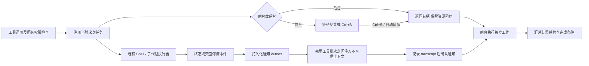

# 普通任务的后台执行

本轮实现覆盖本地 Shell、子代理（`dispatch_agent`）和进程内队友（`teammate_spawn`）。它们共享任务记录、查询/停止接口、后台通知和完成检查。沿用 Open-ClaudeCode 的任务句柄、前后台标记、结束通知去重和 Shell 停滞诊断思路，同时复用本项目现有的 ProcessSupervisor、ExecutionScope、权限检查和资源租约。

远程代理、workflow、MCP monitor、dream 暂未接入这个公共后台协议。任务属于发起它的当前执行轮次；Esc、轮次超时、异常退出、切换会话和关闭会话会回收所属工作。后台操作不跨用户轮次脱离运行，也不会移除原有 Shell 硬超时。

## 使用方式

- 模型为 `bash`、`powershell`、`dispatch_agent` 或 `teammate_spawn` 传入 `run_in_background=true`，立即取得句柄，并继续做独立工作。
- 交互终端按 `Ctrl+B`，将当前轮次注册的所有运行中任务一起转入后台。原有 KeyInterrupt 输入路径也消费同一广播机制。
- `background_tasks` 列出公共任务记录；`task_output(task_id=...)` 查询输出与状态；`task_stop(task_id=...)` 停止指定任务。队友返回 `background_task_id`，团队业务任务 ID 保存在 `team_task_id`，避免混用。
- `Ctrl+T` 显示 todos、后台任务和输入队列；`/tasks` 即时列出任务；`/tasks stop <id>` 即时停止任务。
- Shell 原有 15 秒自动后台化保持不变。代理自动后台化默认关闭（`agent_auto_background_seconds=0`），可通过配置开启。

后台不会绕过权限或释放尚在使用的资源。Shell 保留全工作区写租约，所以前台文件操作通常需要等它结束；只读子代理可以和其他读取任务重叠，仍会阻挡冲突的写入。同轮次及跨工具轮次的资源冲突继续返回 `DependencyStillRunning`，不记为反复失败；整批都因此等待时，主循环等待任务事件后再调用模型。

租约由实际执行任务持有。`task_output` 只返回状态快照，不因快照显示 running 而额外持有读租约；查询输出后可以继续调用 `task_stop`。

## 核心流程



`BackgroundTaskManager` 管理 `task_id`、类型、所属任务轮次、描述、状态、前后台标记、必需性、结果、元数据和通知去重标记。它只统一生命周期协议，Shell 的进程、输出限额、进程树和执行超时仍由 ProcessSupervisor 管理。代理任务使用 ExecutionScope 注册的 asyncio task，沿用既有子代理工厂、模型并发门和权限收窄。

任务存储复用既有审计脱敏规则；没有显式描述的 Shell 只保存结构化命令预览，不把完整命令参数另存为任务描述。权限对象、授权记录和环境凭据不从执行上下文复制进任务协议。旧返回字符串的代理工厂和嵌入方替换工厂继续可用；内置结构化结果保留子任务的真实完成/未验证状态。

结束事件使用稳定的 `task_id:finished`；交互停滞事件使用 `task_id:interactive_input`。每个事件单独生成具有稳定 UUID 的消息，按消息预算缩短字段，保留合法 JSON。通知不运行 `UserPromptSubmit`，不产生新权限授权，并通过 `PromptSource.BACKGROUND_TASK` 的不可信上下文入口进行处理。

outbox 通过 JournalStorage 的私有存储写入版本化 `background-state.json`，使用临时文件、flush/fsync 和原子替换。主代理使用会话恢复目录，子代理使用各自 run 目录，避免把父任务误判为失联。只有 transcript 成功写入（或明确关闭 transcript）后才确认通知；失败时保留通知，并阻止无条件宣称完成。恢复时，根据 transcript 中的稳定事件 ID 确认已记录事件，不重复注入；即使通知已被上下文压缩移出当前消息链，也会流式核对原始 transcript 的合法通知消息。历史运行记录中仍在运行的任务标记为 `lost`，不自动重启；恢复同一个任务可以收到失联通知，开始新的用户任务会归档旧通知，历史结果仍能查询。

模型尝试结束且仍有后台工作时，主循环等待事件，并定期检查取消、截止时间和用户输入，不反复调用模型轮询。结束通知返回模型后才能汇总。失败、失联、未验证或仍运行的必需任务会进入最终完成检查。显式 `task_stop` 或 `/tasks stop` 表示用户/代理主动撤回该任务的必需性，终态和结果记录仍保留；停止任务本身不会替代其他计划或验收条件。

## Shell 停滞诊断

默认每 5 秒检查一次；连续 45 秒没有新增输出，且最近 1 KB 输出的最后一个非空行出现 `(y/n)`、`[y/n]`、`(yes/no)`、`Press Enter`、`Continue?`、`Overwrite?` 或常见确认问句时，发送一次提示。单纯安静不构成失败，诊断不会自动终止进程，也不会自动输入确认。前台时已检测到的提示会在后台化时补发。模型应结合 `task_output` 检查，按需停止并使用明确的非交互参数重新启动。

## 修改模块

| 模块 | 作用 |
| --- | --- |
| `background_tasks.py` / `background_store.py` | 公共任务协议、容量限制、结果与 outbox、恢复与持久化 |
| `shell_watchdog.py` / `process_supervisor.py` | 停滞检测、进程树回收、统一终态事件和日志失败状态 |
| `tools/shell.py` / `tools/subagent.py` / `tools/team.py` / `tools/background.py` | 后台化与统一查询/停止/列表接口 |
| `tools/executor.py` | 根据公共句柄保留租约，识别后台依赖状态 |
| `react.py` / `task_runtime.py` / `prompt_ingress.py` | 工厂保留真实结果状态、安全边界通知、事件等待、最终完成门 |
| `session.py` / `worktree.py` | 会话资源清理、后台工作期间禁止切换执行工作区 |
| `cli.py` / `chat_commands.py` / `ui.py` | Ctrl+B 广播、Ctrl+T 和 /tasks、后台状态显示 |
| `tool_config.py` / `tools/local.py` / `agent.toml.example` | 配置解析、允许设置项与示例 |

## 验收

`tests/test_background_tasks.py` 使用确定性假模型、受控异步任务和真实本地 Python 子进程，覆盖通知去重、持久化及恢复、所有退出路径的回收、资源租约、子结果状态、停滞诊断、统一工具与 CLI 命令。它不需要真实模型服务。

Shell 工具的前台、显式后台、自动后台、Ctrl+B 四种路径分别通过实际 Python 子进程验收两个工具的绑定和生成的 argv。原生 Bash/PowerShell 测试另行运行：缺少 Git Bash，或主机拒绝 PowerShell AST 语法检查（WinError 5）时明确跳过，不能视为原生 Shell 验收通过。

```powershell
.\.venv\Scripts\python.exe -m pytest tests/test_background_tasks.py -q -p no:cacheprovider
.\.venv\Scripts\python.exe -m pytest -q -p no:cacheprovider
.\.venv\Scripts\python.exe -m ruff check agent_core tests/test_background_tasks.py
.\.venv\Scripts\python.exe -m mypy agent_core
```

修改项目文件期间不要运行会把当前工作区作为验收对象的回归测试；RevisionTracker 会检测这种并发变化并拒绝把它当作稳定版本。全量回归应在代码与文档修改完成后执行。
