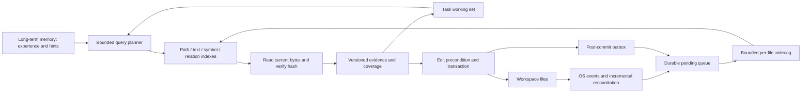

# Versioned code intelligence

Code intelligence is independent of long-term memory. The filesystem is authoritative;
the index is a disposable, versioned projection. Historical architecture knowledge may
suggest paths or symbols but cannot satisfy an edit precondition.

## Usage

```powershell
polaris code build --workspace . --seconds 120
polaris code status --workspace .
polaris code search target_function --kind symbol
polaris code search target_function --kind calls
polaris code reconcile --audit --seconds 120
```

Build/reconcile work is sliced, durable and resumable. Exit code 2 means work remains,
not a successful full scan. Run the same command again to continue. Queries do not
implicitly rebuild the whole index. A cold Agent starts bounded background construction
on first use; legacy searches use the bounded filesystem fallback with an explicit
notice while the catalog is cold. `maintain=false` disables background construction
(indexes are then built only via `polaris code build`); `watch=false` disables only
OS event watching, with periodic reconciliation as the fallback.
Search also returns exit code 2 for incomplete coverage (including unresolved syntactic
relations); consumers should inspect the JSON rather than treating it as a tool failure.

`code_search`, `code_relations` and `code_context` are deferred tools discoverable with
`tool_search`. `code_search` selects paths, symbols or text; an identifier first tries
symbols and then text under the same budget. Explicit `kind` bypasses classification.
Current task modules are searched first; zero hits permit a wider indexed query under
the same budget. Explicit path/modules remain scoped; `expand=true` starts wider.
Coverage lists the actual checked ranges. `code_relations` supports incoming/outgoing syntactic edges and bounded
depth expansion. These candidates are not type-resolved proofs of a complete call graph.

Legacy `glob` keeps newest-first ordering. `search_text` retains substring/regex semantics,
including basename glob filtering. Bounded scans do not interpret `.gitignore`; shared
VCS/build/runtime exclusions apply at traversal entry. Secrets and redirected paths are
not indexed. Unsupported files/encodings and oversized files are reported as exclusions.

## Implemented capabilities and boundaries

| Capability | Current implementation |
|---|---|
| Inventory | Persistent SQLite file catalog, path/language/module/size/mtime/hash/revision |
| Incremental updates | Durable post-commit outbox, idempotent pending queue, external events |
| Reconciliation | Resumable directory queue; restart redoes only unfinished directories |
| Text | SQLite FTS5 trigram candidate generation, original-content verification |
| Symbols | Python AST functions, classes and assignment targets |
| References | Python syntactic names, calls, imports and inheritance; unresolved by design |
| Package/build facts | Static package.json, pyproject.toml, Cargo.toml and go.mod dependencies |
| Other languages | Path/text retrieval; configured LSP tools remain available |
| Working set | Bounded task-local versioned ranges, module hints, compaction references |
| Versions | SHA-256 of original bytes, worktree identity, index revision |
| Partitioning | Worktree/policy-isolated databases; indexed logical module partitions |
| Cache | Bounded content-addressed line cache; hash verification remains mandatory |
| Semantic embeddings | Intentionally not enabled or implemented in this release |

Modules currently use the first path component (root files belong to `.`). This is a
directory partition, not a claim to resolve every build-system package boundary.
High-precision cross-language graphs, build target resolution, physical module shards,
an independent daemon and selected semantic indexing are subsequent extensions.



## Contracts

Persisted code schema and change outbox schema are version 1. Existing Message and
ToolResult contracts remain unchanged. New fields are carried in namespaced metadata,
with visible coverage/version details in the new code-tool result body.

`SearchPage` contains hits, generation, cursor, usage and `SearchCoverage`. Every code
hit has path, range, original-byte hash, worktree ID and revision. Path-only hits have
no fabricated code range. A cursor binds the query and index generation; if the
generation moves mid-pagination (any indexed change), the query returns an empty page
with a `generation_changed` coverage reason instead of an error — restart without the
cursor. Line numbers are one-based.

`coverage.complete` is relative to the requested **indexed observation**, not an atomic
snapshot of a live filesystem. `freshness` explicitly describes this distinction.
Watcher lag, pending changes, incomplete discovery, excluded files, unsupported
structure and exhausted budgets prevent whole-repository conclusions. A no-match
result is never evidence of absence in unexamined modules. Precision disclosures
(e.g. `python_syntax_only`) live in `coverage.advisories` and never affect
`complete`; completeness is about coverage, not about syntactic precision.

File reads verify size, identity and timestamps around bounded byte reads. The content
hash and parsed evidence refer to those bytes. A slow index task cannot overwrite a
newer pending event; text/symbols/edges publish together in one SQLite transaction.
Changed content is hash-verified again before being returned. Even a timestamp-preserving
edit invalidates the old hit; periodic hash audits discover missed changes.

## Edit safety and transaction projection

`read_text_file` returns `file_version`. `edit_file`, `multi_edit` and `write_text_file`
accept `expected_version`; `apply_patch` accepts an `expected_versions` map. Agent
execution also binds the latest verified read version without requiring the model to
copy the hash. Changed files raise `StaleEvidence`; the Agent must reread and reconsider.
`strict_versions=true` requires such evidence before editing existing ordinary files.
Creation can express `{"exists": false}`. Legacy direct callers can omit versions while
strict mode is off. Notebook's existing verified-read behavior remains intact.

The executor still enforces transaction resource dependencies and commit-time hashes.
`ResourceLock.materialize=false` is used only by audited query tools: queries merge
original files and the current overlay without recursively copying a directory. Actual
read hashes and observed directory membership fingerprints are validated on commit.
Membership fingerprints exist to catch "a file appeared/disappeared in a directory my
listing claimed to enumerate"; content edits to existing files are covered by the
per-read hashes instead. External churn inside a scanned directory therefore fails the
turn loudly (the write is rolled back and retried by the loop), which is deliberate:
listing evidence must describe the tree the commit lands on. Writes remain confined to
declared write resources. Rollback does not publish the overlay
to the shared code index. The original recovery journal stays authoritative; the code
outbox is an additional replayable projection. Index failures after commit are observable
and do not retroactively turn a successful filesystem commit into a rollback.

These checks coordinate internal writers and detect observed external changes. Ordinary
filesystems do not provide a general atomic multi-file compare-and-swap against arbitrary
external writers. Tasks requiring a globally immutable view should analyze a fixed Git
commit/worktree snapshot rather than claim that a live watcher provides that guarantee.

## Maintenance, permissions and lifecycle

The default directory is `$POLARIS_HOME/codeintel/<worktree-id>/` (otherwise
`~/.polaris/codeintel/`). It is separate from memory indexes and contains only rebuildable
code data. Policies with restricted reads use separate index files; the actual result
path is checked again against current read restrictions. No repository-provided parser,
build script, package manager or executable is run by indexing.

Install the `codeintel` extra for watchdog OS events. Without it, status explicitly says
`periodic_reconciliation_only`. OS watches are capped at 512 directories; reconciliation
also covers unwatched directories, event overflow, lost events and offline edits.
Hourly-or-slower hash auditing is incremental, and budgets prevent a single pass from
monopolizing resources. IDE unsaved buffers are not part of the disk view.

Agents on the same event loop, worktree, config and permission policy share maintenance
and a ref-counted service. Cross-process writers use a file lock; readers use SQLite WAL.
Resume and worktree changes release the old service and clear active evidence. Long-term
memory can be disabled without disabling any of this functionality.

Normal application uninstall retains this independent cache with other user data;
the existing `--purge-data` removes the default `~/.polaris` tree. A custom
`POLARIS_HOME` remains under its owner's lifecycle. No automatic recursive deletion of
custom paths is introduced. Index/schema upgrades should rebuild into a fresh directory
after closing users of the old service, rather than mutate memory or recovery journals.

## Resource limits and performance

`[codeintel]` controls deadlines, files, bytes, per-file bytes, candidates, results,
context tokens, graph depth/edges, module fan-out, cache entries and index disk quota.
One budget covers all stages and fallbacks. SQL has a progress interrupt; regex runs in
one killable subprocess per query (all candidates are framed through a single bounded
pipe, never one process per file). Cancellation reaps query subprocesses and
cooperative workers. Output uses a conservative UTF-8 byte bound
for evidence (including serialized hit hashes/paths); the small coverage envelope is
additional. Legacy file reads have an additional 16 MiB ceiling. Per-file parsing and
SQLite transaction commit are cooperative boundaries, not forcibly preempted operations.
The disk quota includes WAL and is checked between bounded slices; one slice may overshoot.

Indexing commits in bounded chunks (128 files) within a bounded time slice, so writers
never hold the SQLite write lock long enough to fail concurrent queries; a busy writer
defers a query's outbox replay instead of erroring (coverage reports
`commit_replay_deferred`). A retained connection avoids checkpointing WAL after every
file. Symbols have indexes on name, qualified name and
file owner, so updating one file does not scan every symbol. The code-layer cache does
not suppress content validation. Physical shards should be introduced based on measured
write pressure and index size, without changing the public query contracts.

## Delivery stages and compatibility

| Stage | Files/modules and contracts | Status |
|---|---|---|
| 0. Budgets and boundaries | `codeintel/config.py`, `budget.py`, `models.py`; `QueryBudget`, `FileVersion`, `SearchPage`; existing `ExecutionScope` | Implemented, required |
| 1. Inventory and change tracking | `store.py`, `catalog.py`, `indexer.py`, `changes.py`, `watcher.py`; file/pending/directory queues, commit sequence, schema v1 | Implemented, required |
| 2. Structured retrieval | `backends.py`, `service.py`, `cache.py`; `SearchRequest`, atomic per-file symbol/edge ownership, logical module scope | Implemented for Python/static manifests; path/text for other languages |
| 3. Agent integration | `tools/codeintel.py`, `tools/base.py`, `tools/registry.py`, `runtime.py`, `working_set.py`, `react.py`, `session.py`, `worktree.py`; task ranges and reference-counted service | Implemented, required |
| 4. Edit/transaction consistency | `snapshots.py`, `tools/builtin.py`, `tools/editing.py`, `tools/executor.py`, `tools/transaction.py`, `lsp.py`; expected versions, query overlay and post-commit outbox | Implemented, required |
| 5. Operations and validation | `cli.py`, `config.py`, `health.py`, configuration example, `tests/test_codeintel.py`, `benchmarks/codeintel.py`; status/build/reconcile/search | Implemented; workload-specific capacity tuning remains necessary |
| 6. Advanced acceleration | Type-resolved multi-language backends, physical shards/daemon, query-plan cache, build-system module boundaries and selective semantic vectors | Deferred optimizations |

The required compatibility changes are explicit: searches may return fewer results
with partial coverage; UTF-8/size/exclusion limits can omit previously scanned files;
stale read-to-edit evidence now rejects a write. `expected_version` fields are optional
for legacy direct callers, and strict mode is opt-in. Disabling `[codeintel].enabled`
removes the whole layer from the agent loop: the `code_*` tools are unregistered,
`read_text_file` issues no version metadata, searches keep the bounded filesystem
scan, no working set or post-compaction reference list is produced, and executor
version binding stays off. Explicitly caller-supplied `expected_version` arguments are
still honored — disabling never silently accepts a stale-write guard the caller asked
for. Ordinary public tool names and `ToolResult` serialization stay compatible.
Existing memory files, transcript schemas and recovery journal states do not require
migration.

The current implementation is an in-process service with a separate store and API.
Physical module sharding is not needed to validate this boundary; it remains a response
to measured write contention or index size. Full call-graph correctness, workspace-wide
LSP result federation and persistent task work-set restore are not claimed by this release.

## Validation commands

```powershell
.venv/Scripts/python.exe -m pytest -q tests/test_codeintel.py
.venv/Scripts/python.exe benchmarks/codeintel.py --lines 10000000 --samples 20 --output deliverables/codeintel-10m.json
.venv/Scripts/python.exe -m ruff check agent_core tests installer
.venv/Scripts/python.exe -m mypy
```

The benchmark creates 32 modules of Python source, includes a complete cold build,
repeated module queries and a single-file update. Its generated functions/assignments
are a reproducible synthetic scale check, not a substitute for a heterogeneous real
monorepo or a promise of universal latency. Limits should be calibrated on deployment
hardware; the artifact records corpus shape, platform, configuration and query coverage.
