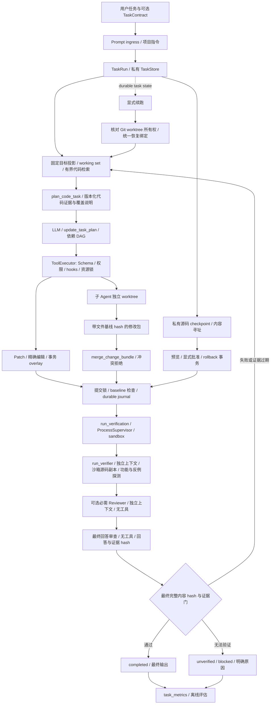

# Coding Agent 任务闭环

本轮在现有 ReAct、ToolExecutor、事务和沙箱之上增加任务契约与客观完成判定，
不替换 provider、权限体系或已有代码检索层。

## 执行链路



主要入口：`react.py:ReActAgent.run`、`task_runtime.py:TaskRun`、
`tools/task_control.py`、`tools/executor.py`、`tools/transaction.py`。

## 任务契约、计划与完成条件

`TaskContract` 包含 goal、constraints、acceptance、checks、allowed_paths、review_required、verification_required。
`update_task_plan` 提交带依赖的步骤，拒绝未知依赖、环路，以及在依赖尚未完成时开始或完成步骤。
它支持替换计划；仅修改步骤状态不会重置重复失败检测。Todo/PlanMode 继续提供原有交互，
不能替代机器验证。

调用方可以锁定检查清单，模型不能删掉或改写它：

```python
from agent_core.task_runtime import TaskContract, VerificationCheck

contract = TaskContract(
    goal="修复解析器并通过回归测试",
    acceptance=("回归测试通过",),
    checks=(VerificationCheck("regression", ("python", "-m", "pytest", "-q")),),
    allowed_paths=("src/parser.py", "tests/test_parser.py"),
    review_required=True,
)
result = await agent.run(contract.goal, task_contract=contract)
assert result.status == "completed", result.answer
```

`allowed_paths` 是最终 diff 范围检查，不是新增的文件访问权限；权限和沙箱仍由现有体系控制。
不传契约时，模型可以通过 `update_task_plan` 声明检查。模型选择的检查可能不充分；
自然语言 acceptance/constraints 的业务语义目前不能自动证明。高要求任务应由调用方指定检查，
同时保留人工或独立审查。

`run_verification` 接受 check_id、显式 argv 和 timeout（1–600 秒，默认 300）。
argv 必须与任务契约一致。命令先经过权限与沙箱，再交给共享 ProcessSupervisor；
权限模式不会因为“验证”二字而自动放行任意命令。裸 `python` 别名使用 Agent 的解释器，
显式绝对解释器路径在 host 模式下保留；guest 模式使用已准备的对应 capability。
其他 host 路径参数不会自动改写为 guest 路径。

证据包含检查 ID、argv hash、workspace、源码内容 hash、退出码、进程状态和日志位置。
只有 **最终版本上的全部必需检查均成功** 才有效。命令自身修改被纳入快照的文件时，
该次证据标为 `revision_changed`，需在稳定版本上重新执行。已有 `run_tests` 可继续使用，
但它不会自动成为任意任务的契约证据；使用 `run_verification` 执行登记的 pytest 检查。

完成判定同时检查未完成的计划/Todo、后台进程、provider 未证明结束或截断的响应、
越界 diff、无进展和缺失/过期/失败的证据。只读任务可以完成；文件修改没有显式检查时为
`unverified`。验证失败最多追加两次修复提示，不使用全局小工具次数上限。
Stop/观察 hook 结束后再检查版本；hook 导致证据失效也需要重新验证。

`AgentRunResult` 增加 status、verification、task_id，原有字段顺序保持兼容。
status 为 `running/completed/unverified/blocked/failed/cancelled` 中相应终态；
`polaris run` 成功为 0，中断为 130，未验证或阻塞为 2，运行异常为 1。
最终 run log 包含 status 与 verification。终态告警通过流式 UI 的独立停止提示显示。

## 上下文与状态恢复

每轮重新投影有界的原始目标、约束、未完成步骤和最近失败，不依赖 LLM 摘要记住任务。
`task_state` 按页获取完整计划、检查、失败和证据。working set 在新任务/workspace 切换时清理。
项目上下文加载 `CLAUDE.md` 和 `AGENTS.md`；读取文件后加载所在目录的嵌套规则，
保留至多八个有界 scope。稀缺预算优先保留较近目录的规则，规则仍属不可信仓库输入，
不会提升权限。嵌套规则在整个 tool-result 批次之后插入，保持 provider 调用配对。

`TaskStore` 使用 schema v3 私有原子记录，兼容读取 v1/v2，不存储权限授权。普通 `--resume` 仍恢复会话消息，
父任务使用稳定 session 记录，子任务使用各自 run partition，避免共享 session ID 时互相覆盖。
明确续跑任务需同时选择原会话，例如：

```console
polaris run "继续原任务" --resume SESSION_ID --resume-task
```

仅恢复未完成任务，保留目标、计划、失败与证据。任务记录中包含 worktree binding 时，
核对项目/session、配置目录、Git 注册、分支 namespace 与基线祖先，再恢复统一绑定；
不匹配、已删除或切到外来分支时拒绝，不创建替代目录，也不继承旧权限。
调用 `run(..., resume_task=True)` 遵循同一规则。没有 binding 的旧记录需要宿主恢复正确 workspace。
失败记录保存参数指纹而非原始参数；同一代码和语义计划下三次相同失败会触发无进展检测，
给出有限修复机会后返回 blocked。

`create_checkpoint` 保存任务所有的源码 manifest 与内容寻址 blob；最大 20,000 文件/512 MiB，
每个 store 总量 1 GiB、至多 128 个 manifest，达到上限明确失败，不自动删历史。
同一内容去重；manifest 保留 hash，但受 read deny/ask 限制的源码字节不复制。
Secret、运行状态和缓存排除，checkpoint 不备份 Git 对象、权限授权或外部系统状态。

`rollback_checkpoint` 必须指定 checkpoint_id 与至多 128 个规范相对 paths。默认 preview
返回 expected_revision，实际执行必须带匹配版本且经显式交互批准（bypass 与自动分类器不能跳过）。
所有路径都经保护/读写策略检查，限于同一任务、workspace 和范围；完整预检后通过 sparse overlay
与 durable journal 一次提交。并发修改被 CAS 拒绝；旧测试/审查证据清空、计划步骤回到 pending。
预检失败不会写任何文件。任务状态的保守失效可先于提交，恢复失败也不能复用旧证明。
现有 turn 事务回滚和显式 journal recovery 继续负责执行恢复；不自动重试外部副作用。

## 独立 Reviewer 与代码规划

`polaris run TASK --require-review` 或 `TaskContract(review_required=True)` 在任务开始保存原始
源码基线；全部客观检查通过后才自动审查，执行 Agent 不参与裁决。Reviewer 只收到契约、
真实变更、最终源码与当前检查证据，不收到执行历史，provider tools 为空。它使用同一配置的
独立模型调用，不代表不同模型/不同供应商的独立性；仍有相同模型的相关盲点。

`run_review` 可显式重跑；先于修改执行 `create_checkpoint` 也能提供任务原始基线。
审查返回严格 JSON，截断/未证明结束/工具请求/非法字段一律 incomplete；Python/JSON 语法
失败不能被模型 passed 覆盖。读策略覆盖相对与绝对路径。64 文件/128 KiB 源码预算、
160 KiB payload 超限时失败，不靠截断后放行。结果绑定 workspace、内容 hash 和契约 hash；
审查期间文件变化失效；同版本失败不无限自动重跑。完成仍需要测试证据，不由 Reviewer 替代。
最近审查摘要随任务目标重新投影，完整 findings 可通过 task_state(section=reviews) 分页获取。
Reviewer/Planner 输出不超过调用方配置的 max_tokens，并额外封顶 4,096；预算不足会明确失败。

`plan_code_task` 接受 1–4 个符号查询，结合 symbol/text 检索及一层关系，读取至多八个
120 行版本化区域，并向无工具、独立上下文的 provider 请求依赖计划。返回的 pending 步骤
含 paths，经 DAG/范围/读策略和代码新鲜度校验后持久化。检查清单不被该工具改写。
当前 Python 提供 AST 符号/关系，其他语言主要提供字面上下文与 manifest 依赖。本工具尚未
接入 LSP 类型关系，执行 Agent 可单独调用现有 LSP 工具。报告保留覆盖与精度限制，
不能称为全语言类型解析或全依赖解析。

## 独立行为验证与最终回答审查

本项目移植了参考项目的功能验证、反例探测、阶段提醒、结构化 hook 裁决与项目验证指南机制，
并将它们接入现有确定性完成门。参考项目中的验证 Agent 默认受关闭的功能开关控制，
Todo 提醒本身不会执行验证；本项目显式启用后会实际执行探测并保存证据。

仓库 `agent.toml` 使用 `[verifier] mode = "auto"`：源码发生变更时要求独立行为验证；
有工具观察/执行证据的最终回答要求独立回答审查。纯聊天不额外调用模型。
库 API 的 `ReActConfig()` 默认 `mode = "off"`，保持已有调用兼容。
`mode = "required"`、`polaris run TASK --require-verification` 或
`TaskContract(verification_required=True)` 要求行为验证，即使任务没有修改源码。
`check_answer` 控制额外的回答审查，默认 true；命令行强制选项不会覆盖显式 false。

```toml
[verifier]
mode = "auto"              # off | auto | required
model = ""                 # 继承主模型，或同一 provider 的受支持模型
check_answer = true
timeout = 300              # 行为验证总预算，包含模型与工具执行
max_tokens = 4096
max_repair_attempts = 2     # 完成验证失败后的主循环修复机会
max_probes = 12
max_context_bytes = 163840
stage_checks = false       # 至少三步计划全部完成时，可额外自动验证
min_changed_files = 0      # auto 模式下变更文件数低于该阈值时跳过行为验证 LLM
                           #（0 = 任何变更都验证）；确定性完成门与回答审查不受影响
```

也可设置 `AGENT_VERIFIER_MODE`。建议为 verifier 配置不同（理想情况下更强）的模型，
可降低同模型自审的共同盲点，但仍不是完全独立的正确性证明。
验证会增加模型调用与执行时间；辅助模型 usage 纳入任务计数及 `verifier_usage` 日志。
不可信仓库不能通过 verifier.mode=off、check_answer=false、调大 min_changed_files
或切换模型削弱验证设置；显式 `--config` 仍按现有用户配置规则处理。

`run_verifier` 可手动重跑或用于完成一个阶段后的验证。显式调用后的裁决也作为本任务完成条件，
失败不会因没有源码变更或 mode=off 而被忽略。它创建经过内容 hash 检查的临时源码副本，
向独立模型提供契约、文件清单、变更路径、已有检查结果与项目指南，不提供执行 Agent 的历史。
只暴露读取、`verifier_probe` 和已连接的浏览器 MCP 探测入口；没有源码编辑、依赖安装、
子 Agent 或契约改写工具。探测命令经父任务原有权限规则、hooks、沙箱及 ProcessSupervisor 执行，
父工作区只读，副本可生成运行产物但已复制的源码必须保持不变。共享取消、截止时间及进程树清理。

每个探测声明 functional/adversarial、验收条件、argv、预期退出码及输出；框架保存真实退出码、
状态、输出摘要/日志、输出 hash 与证据 ID。模型必须判断探测是否充分覆盖本次任务。
PASS 至少需要一个实际通过的功能探测和一个反例/边界/回归探测，且不能有失败探测。
退出码和输出匹配是可执行门槛，不保证探测语义充分；仅打印 PASS 或只跑类型检查不能替代功能验收。
测试预期的非零退出码可作为有效反例证据，必须同时核对具体错误输出。

结果严格为 `{"verdict":"PASS|FAIL|PARTIAL","findings":[{"claim":"...","reason":"...","evidence_ids":["..."]}]}`。
引用不存在的证据、非法/截断/未证明终止的输出、被拒绝的能力、超限或超时均不会通过。
PASS/FAIL/PARTIAL 对应 passed/blocked/incomplete；最终完成门不通过时主任务返回 unverified
（或现有无进展条件下 blocked），修复机会耗尽也不会自动改为 completed。
原有注册检查、未完成计划/Todo、后台进程、范围限制及可选代码审查继续生效；
行为验证不会替代调用方声明的 `run_verification` 检查。

每条验证记录带 `failure_class`：`verdict`（模型裁决未通过）、`environment`（沙箱/权限/工作区
并发变更等环境限制）、`budget`（超时、截止时间、上下文或探测预算）、`transient`（验证器输出
非法，重跑可能恢复）。完成门 issue 以 `[类别]` 前缀标注。当全部剩余 issue 都是 environment/budget
类时，主循环不再注入"修复"消息、也不消耗修复机会——这类失败无法通过主 Agent 修代码解决，
任务直接以 unverified 结束并由回答如实说明限制。其余类别沿用修复循环，且注入消息会附带最近
失败记录的结构化 findings（claim/原因/失败探测的 argv 与期望），减少一轮 task_state 往返。
重跑行为验证时，payload 的 `previous_attempts_untrusted` 携带本任务最近失败裁决的
verdict/findings/reason（标注为不可信上下文），避免验证器重复已被排除的假设；
它不保留验证器对话历史，裁决标准不得因此降低。

独立回答审查只接收当前版本的检查、工具观察、行为探测和候选最终回答，tools 为空。
它检查“测试通过”“修改完成”等断言是否有证据支撑、是否与失败结果矛盾、是否隐瞒限制。
除当前版本观察外，`stale_observations` 附带最近 16 条历史观察（标注 stale 及原 revision），
防止"测试跑完后又改了无关文件"的合理声明被误判为无证据；涉及文件此后发生变更的过期观察
不得作为通过依据。契约检查的注册证据仍严格绑定最终版本。
审查记录绑定 workspace、源码版本、契约、回答 hash 和证据 hash。回答改写或证据增加后重新审查。
工具观察保留读取路径；有文件版本信息时，排除与当前源码 hash 不一致的读取结果，避免将旧内容绑定到新版本。
Stop/后台观察 hook 完成后再次检查版本、任务条件及回答证据，防止旧裁决被复用。
同一版本的失败行为裁决不会无限自动重试；修复后或手动 `run_verifier` 可产生新证据。

`task_state(section="verifier_runs")`、`answer_reviews`、`observations` 可分页查询，
完整记录保存于 task-state schema v3，事件日志包含 `verifier`、`verifier_probe`、
`verifier_browser_probe` 和 `answer_review`。Verifier 记录使用 schema_version=1，运行日志仍使用 v2。
阶段计划至少三步全部完成时提示验证；
开启 stage_checks 后实际自动触发。提醒本身不等于通过证据。

项目指南在 `.polaris/skills/*verifier*/SKILL.md`，作为有界、不可信上下文单独传入。
使用 `/init-verifiers` 可根据实际 CLI/API/browser 入口生成或更新指南。
本仓库已提供 `.polaris/skills/verifier-cli/SKILL.md` 与
`benchmarks/verifier_cli_smoke.py`：功能场景验证公开 CLI 的回答、退出码和日志，
反例场景验证错误参数及无沙箱时强制验证的失败返回。脚本使用隔离配置和临时状态目录，
不使用真实模型；特定业务变更仍须补充针对它的探测。指南变化后应显式重跑 run_verifier。

行为验证必须具备已准备好的真实沙箱；不会回退为宿主机执行。
源码副本不含 .git、.venv、node_modules、根目录 .polaris/runs/tmp/memory 和 Secret 文件，
依赖必须已存在于执行环境。缺少沙箱、依赖或能力时明确 PARTIAL。
命令探测保留 network=deny；需要监听/网络的 API 应在支持该能力的既有受控测试方式中检查，
无法运行就报告缺失。浏览器仅转发已连接的 playwright、claude-in-chrome、chrome_devtools
等命名的 MCP 服务工具，并逐次执行父任务权限检查；不会自动启动/安装浏览器服务或授权。
当前没有进行真实模型或真实 Container/VM 的端到端验证；替身沙箱测试仅证明调用边界。

## 结构化 prompt/agent hook gate

旧 prompt/agent hook 默认 `decision_mode = "advisory"`，回复作为建议上下文，Stop 建议会保存并记录。
显式 `decision_mode = "gate"` 将其变为裁决门：接受严格 `{"ok":true}` 或
`{"ok":false,"reason":"具体未满足条件"}`。false 会阻止相应控制动作；错误、超时、缺失依赖、
不完整配置及非法输出失败关闭，不会静默放行。Stop 失败在有界预算内回到主循环，
预算耗尽返回未验证状态。gate 支持 Stop、UserPromptSubmit、PreCompact、PreToolUse、PostToolUse；
不用于 PermissionRequest 自动授权，也不将仅观察事件变为阻断事件。

```toml
[[hooks.external]]
event = "Stop"
type = "prompt"             # agent 可只读检查项目，禁用嵌套外部 hooks，避免递归
decision_mode = "gate"
prompt = "根据实际证据核对领域验收条件，返回 ok 与未满足条件的 reason。"
timeout = 30
```

prompt gate 无工具；agent gate 只读检查项目。需要真正执行功能探测时使用 run_verifier。
上述 gate 是可选领域补充；默认 verifier 已覆盖一般完成/回答审查，无需重复配置。

## 编辑、工作区与多 Agent

Patch 严格检查 hunk header/counts，优先使用声明位置；位置漂移时仅接受唯一匹配的旧文本。
重复锚点且位置不匹配时拒绝猜测。纯插入采用声明位置，支持多文件事务，保留 CRLF 和 EOF 换行标记。
精确字符串编辑及 multi_edit 使用原始换行读取。

worktree 默认目录改为 `.polaris-worktrees`。旧配置 `.polaris/worktrees` 仍受保护路径策略约束，
不通过放宽 `.polaris` 保护来绕开它。切换时统一更新工具、权限、沙箱和 journal 所有权，
清理 LSP/检索状态；切换调用必须独占一个 tool turn，不能和文件编辑混发。
会话 transcript 的项目身份保持稳定。

独立 worktree 子 Agent 从 Git HEAD 开始，不自动复制父目录未提交的修改。
子 Agent 留下变更时返回 bundle_id；UTF-8 文本修改包保存在父会话私有目录，最多 16 MiB。
二进制或过大修改会返回 bundle_error，保留 worktree 供处理。模型收到 ID 和摘要，而不是整个 diff。
父 Agent 调用 `merge_change_bundle`：

1. 校验 bundle 的父 workspace 与每个路径的保护/Secret 权限。
2. 默认 strict 比较全部目标 hash 与子任务基线；任何冲突都拒绝全部修改。
   显式 strategy=three_way 时使用私有 UTF-8 base blob 合并不重叠文本区间；Python 额外使用
   AST 所有权拒绝同函数、重复符号、同类接口或接口/方法交叉修改，再校验合并语法。
   不用 ast.unparse，保留 CRLF、注释与格式。非 Python 只提供保守行级合并。
   缺少 base、二进制、增删冲突或模糊插入仍拒绝；一个文件冲突时全部文件不提交。
3. 通过现有 overlay 执行新增、修改和删除；最终提交再检查基线。
4. 在父 workspace 对合并结果统一验证。

生产私有 journal partition 使用项目级跨进程提交锁，将 baseline 校验和文件替换放进同一
临界区。显式 `JournalStorage.local` embedding 只保证同进程提交互斥，跨进程 embedding
应使用生产 partition 或由宿主提供协调。外部编辑器/Git/Shell 不遵循 advisory lock，
仍需在隔离 workspace 执行。共享 workspace full 子任务保持写锁；独立 worktree 子任务
对父目录持读锁，允许彼此并发；Python AST 检查只防可识别的所有权冲突，不证明语义独立性。
修改包 v2 可读 v1；旧包没有 base 时保留 strict 行为。base 捕获最多 64 MiB，单文件 2 MiB，
累计 store 512 MiB；包的 base 与修改内容共享 16 MiB 预算，超限保留 worktree。

## 进程与沙箱边界

`run_tests` 改为 async 的共享进程监管入口，与 Shell 一样采用有界日志、超时、取消和
kill-and-await 清理，测试持 workspace 写锁。默认子进程环境只继承平台运行必需的白名单，
不继承 OPENAI_API_KEY 等宿主凭据。依赖自定义环境变量的项目需显式建立受控环境，
当前验证工具不提供模型可设置的任意 env 字段。

Container 的嵌套 deny_write 使用只读挂载；不存在的目标不能可靠覆盖，因而拒绝执行。
Container 暂不支持 deny_read，配置该策略时明确失败，需选择支持读屏蔽的 backend。
没有通过静默忽略策略保持“可运行”。这部分由参数构造和拒绝路径测试覆盖，不能代替
真实 Docker/VM 的系统级验证。

## 快照测量与任务评估

`RevisionTracker` 默认遍历目录；`[context].git_aware_revisions=true` 显式启用 tracked +
untracked 非忽略文件的 Git inventory，Git 不可用时记录降级并遍历。已跟踪的忽略文件仍纳入；
Secret/显式运行状态排除。Git submodule 未递归解析时不能认证，需显式处理覆盖。
规划与工具批次后的进展指纹可以利用 stat hint 缓存；测试前后、审查结束与最终输出始终 strict 重读内容，核对成员与
目录/文件稳定性。缓存不会产生最终证明。内部 Git 使用有界输出、共享 deadline、受控环境、
禁用 hooks/fsmonitor，并在超时/取消/管道失败后清理进程树。

`benchmarks/revision_snapshots.py` 生成固定规模临时 Git 仓库并比较相同内容的五种路径，
报告见 `benchmarks/revision-snapshot-report.json`。本机 512 文件/32 MiB、五轮样本的完整
遍历约 0.348 s、加强稳定性检查后的遍历约 0.470 s、暖规划 hint 约 0.210 s；
Git strict 约 0.684 s。Git 开销未证明默认收益，因此默认关闭。单文件变化只让规划 hint
重读该文件；最终 strict 仍读取全部纳入内容。仅为合成样本，不声称真实任务端到端加速。

所有启动后的任务终态输出 `task_metrics`，包括耗时、token、检查/工具失败、审查次数、
checkpoint 与快照计数，不写原始失败参数。`benchmarks/task_evaluation.py` 有界读取日志并
聚合终态；相同 task_id 的 resume 使用最后终态去重。completed 比率只表示运行门结果，
不证明业务语义成功，模型未报告 token 时仍为零/未知成本，不能用于费用结论。
`benchmarks/task_safety_scenarios.py` 用 fake provider 执行通过审查、无检查、检查失败、
审查阻断和重复工具失败五类场景，核对真实 final JSONL 和 transcript 工具配对，
输出 `benchmarks/task-safety-report.json`。不声称模型 Coding 能力或真实任务成功率提升。

## 仍需推进的能力

- 快照上限为 20,000 文件/512 MiB，逐文件检查稳定性；不是原子文件系统快照。
  根目录运行状态、依赖和缓存目录、Secret 文件排除；符号链接文件拒绝认证。
  被排除的数据不属于当前完成证据的覆盖面。持续变化的构建产物可能需要第二次稳定验证。
  当前 logger、配置的 run/session/memory 目录被显式排除。其他长写入产物仍可能使证据失效。
- checkpoint 只恢复源码；不自动撤销外部副作用、Git commits、模型调用、授权或后台进程。
- 全语言类型关系和 AST 合并、生产任务成功率基线仍未实现；行为/回答 verifier 可配置同 provider 的模型，原有代码 Reviewer 仍继承主模型。
- Docker 未安装，已检查的 Podman 服务未运行；本机未完成真实 Container/VM 系统级验证。
- 语义任务拆解和检查充分性仍由模型/调用方决定，当前模块不提供任意需求的形式化完成证明。

回归用例见 `tests/test_task_runtime.py`、`tests/test_change_bundles.py`、
`tests/test_editing.py`、`tests/test_context.py`、`tests/test_sandbox.py`。
新增覆盖：`tests/test_checkpoints.py`、`tests/test_independent_review.py`、
`tests/test_semantic_planner.py`、`tests/test_revision_tracker.py`、`tests/test_source_merge.py`、
`tests/test_worktree_resume.py`、`tests/test_task_evaluation.py`。

本轮验收：完整常规回归 1,740 passed / 11 skipped；后续审查反馈与输出预算改动定向
74 passed；CLI/子进程 integration 16 passed。Ruff、Mypy（205 个生产文件）与 diff 检查通过。
符号链接/平台依赖跳过不能替代真实系统验证。离线任务报告逐场景核对 final JSONL 与
transcript 工具配对，未使用真实模型，也未声称生产成功率改善。
