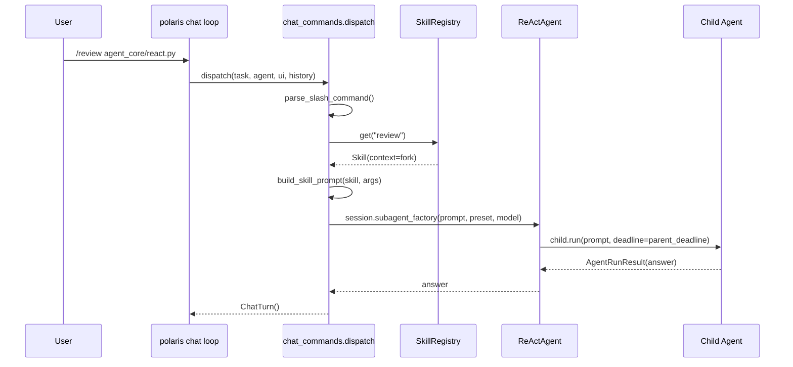
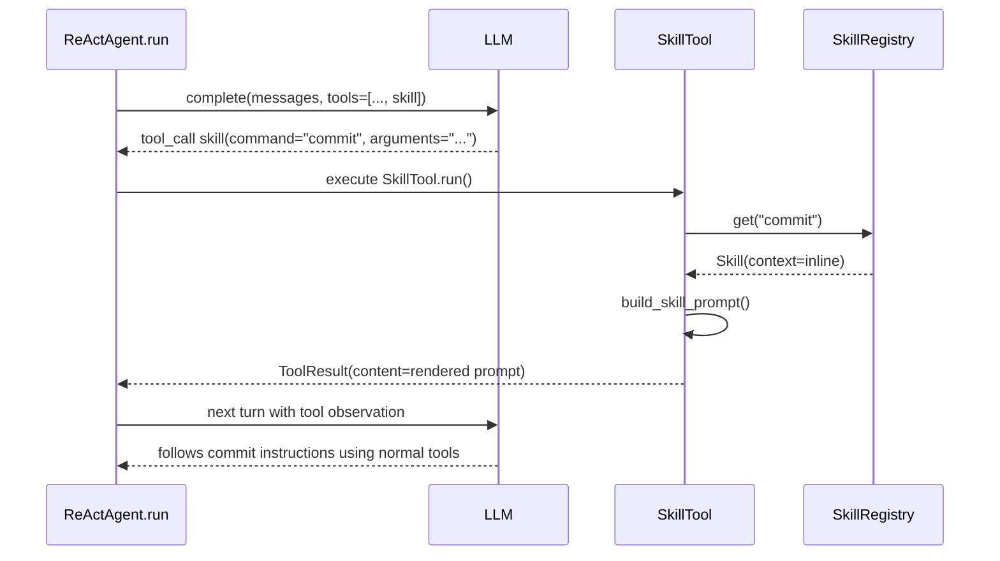

# Commit `2003c846` 深度阅读指南：Skills / Slash Commands 子系统

本文档带你从整体到细节，理解提交
`2003c846ce26aa01a620ae7a9005f7652d527cee` 做了什么、为什么这么做，以及它怎样接入现有 ReAct Agent 框架。

> 阅读建议：这次提交不是一个局部 bugfix，而是一次“子系统落地”。不要从 diff 第一行硬啃，先抓住两条调用路径：人类在 chat 中输入 `/review`，以及模型调用 `skill` 工具。

---

## 目录

1. [提交一句话概括](#1-提交一句话概括)
2. [你需要先理解的核心概念](#2-你需要先理解的核心概念)
3. [改动文件地图](#3-改动文件地图)
4. [整体架构：Skills 子系统放在哪里](#4-整体架构skills-子系统放在哪里)
5. [核心数据模型：Skill 是什么](#5-核心数据模型skill-是什么)
6. [Markdown 技能加载：从 SKILL.md 到 SkillRegistry](#6-markdown-技能加载从-skillmd-到-skillregistry)
7. [Programmatic 技能：运行时生成 prompt](#7-programmatic-技能运行时生成-prompt)
8. [调用路径 A：人类在 chat 里输入斜杠命令](#8-调用路径-a人类在-chat-里输入斜杠命令)
9. [调用路径 B：模型通过 skill 工具调用技能](#9-调用路径-b模型通过-skill-工具调用技能)
10. [ReActAgent 接入点：启动期加载与子 Agent 隔离](#10-reactagent-接入点启动期加载与子-agent-隔离)
11. [配置、打包与依赖](#11-配置打包与依赖)
12. [测试如何保护这个子系统](#12-测试如何保护这个子系统)
13. [一次完整调用的时序图](#13-一次完整调用的时序图)
14. [作为 Agent 开发学生，应该学到什么](#14-作为-agent-开发学生应该学到什么)

---

## 1. 提交一句话概括

这个提交给 Agent 加了一个 **Skills / Slash Commands 子系统**：

- 技能可以写成 Markdown 文件，比如 `review.md`、`commit.md`。
- 人类可以在 `polaris chat` 里输入 `/review some path` 来触发技能。
- 模型也可以通过一个新的 `skill` 工具主动调用合适的技能。
- 技能可以有两种运行方式：
  - `inline`：把技能 prompt 注入当前上下文，让当前 Agent 继续执行。
  - `fork`：开一个隔离的子 Agent 去执行技能，只把最终答案带回来。

用一句更偏架构的话说：

```text
本提交把“可复用 prompt 程序”变成了一等能力，并把它接入了配置、启动加载、聊天命令、模型工具、子 Agent 和测试体系。
```

---

## 2. 你需要先理解的核心概念

### 2.1 Skill 不是普通工具

工具通常是“模型调用一个 Python 函数，拿到结果”：

```text
model -> read_text_file({"path": "..."}) -> 文件内容
```

Skill 更像是“模型或用户调用一段预先写好的工作流程 prompt”：

```text
user -> /review agent_core/react.py -> 生成一段 review 指令 -> Agent 执行
model -> skill(command="review") -> 生成一段 review 指令 -> Agent 执行
```

所以 Skill 的本质不是执行系统命令，而是复用高质量过程说明。

### 2.2 inline 与 fork 是本提交最重要的分岔

```text
inline:
    技能 prompt 回到当前 Agent 上下文
    当前 Agent 继续读文件、改代码、回答

fork:
    技能 prompt 交给子 Agent
    子 Agent 在干净上下文里完成任务
    父 Agent 只看到子 Agent 的最终答案
```

这两个模式对应不同场景：

| 模式 | 适合场景 | 代价 |
|------|----------|------|
| `inline` | commit、remember、simplify 这类需要延续当前上下文的任务 | 会污染/增长当前上下文 |
| `fork` | review、security-review 这类可独立调查的任务 | 子 Agent 有隔离上下文，但需要额外模型调用 |

### 2.3 技能有两类调用者

| 调用者 | 入口 | 典型例子 |
|--------|------|----------|
| 人类用户 | chat 里输入 `/name args` | `/review agent_core/tools` |
| 模型 | 调用 `skill` 工具 | `skill({"command": "review"})` |

技能可以分别控制是否暴露给人类和模型：

```python
user_invocable: bool
disable_model_invocation: bool
```

这点很重要：有些技能适合人类手动触发，但不应让模型自己调用，比如 `debug`、`skillify`。

---

## 3. 改动文件地图

提交统计：`32 files changed, 2283 insertions(+), 17 deletions(-)`。

### 3.1 新增的核心子系统

```text
agent_core/skills/
├── __init__.py                 # 对外导出 Skills API
├── models.py                   # Skill / SkillContext 数据模型
├── config.py                   # SkillsConfig
├── frontmatter.py              # YAML frontmatter 解析
├── loader.py                   # 从 bundled/user/project/extra 目录加载技能
├── registry.py                 # SkillRegistry，支持 name/alias 查询
├── dispatch.py                 # 斜杠命令解析、prompt 渲染、fork preset 判断
├── programmatic.py             # @programmatic_skill 注册机制
├── builtin_programmatic.py     # debug / skillify / lorem-ipsum
└── bundled/
    ├── commit.md
    ├── init.md
    ├── pr-review.md
    ├── remember.md
    ├── review.md
    ├── security-review.md
    ├── simplify.md
    └── verify.md
```

### 3.2 接入现有 Agent 的文件

| 文件 | 作用 |
|------|------|
| `agent_core/react.py` | 启动期加载技能；绑定到 session；无模型可调用技能时隐藏 `skill` 工具；子 Agent 禁用技能 |
| `agent_core/session.py` | `SessionContext` 增加 `skills`、`run_dir`、`run_id` |
| `agent_core/tools/skill.py` | 新增模型可调用的 `skill` 工具 |
| `agent_core/chat_commands.py` | 新增 chat 内置 `/commands` 和技能路由 |
| `agent_core/cli.py` | chat loop 改为先经过 slash command dispatch |
| `agent_core/config.py` | 新增 `resolve_skills_config()` |
| `agent_core/tools/registry.py` | 新增 `unregister()`，用于条件隐藏工具 |
| `agent.toml.example` | 新增 `[skills]` 配置说明 |
| `pyproject.toml` | 新增 `pyyaml` 依赖，并把 bundled Markdown skills 打进包 |

### 3.3 测试文件

| 测试文件 | 保护内容 |
|----------|----------|
| `tests/test_skills_core.py` | frontmatter、loader、registry、dispatch、config |
| `tests/test_skills_programmatic.py` | programmatic skill 注册和 prompt 生成 |
| `tests/test_skill_tool.py` | 模型侧 `skill` 工具和 ReActAgent 接线 |
| `tests/test_chat_commands.py` | chat 斜杠命令、内置命令、技能触发 |

---

## 4. 整体架构：Skills 子系统放在哪里

从系统边界看，这次提交新增的是一个“技能注册表”，它和工具注册表并列存在：

```text
                   +---------------------+
                   |      ReActAgent      |
                   +----------+----------+
                              |
              +---------------+---------------+
              |                               |
       ToolRegistry                    SkillRegistry
       read/edit/git/...                commit/review/...
              |                               |
       exposed as tools                 used by:
                                      - chat_commands
                                      - SkillTool
```

更完整一点：

```text
SKILL.md files / programmatic factories
            |
            v
      load_skills()
            |
            v
      SkillRegistry
            |
      +-----+-------------------+
      |                         |
chat /command              model skill tool
      |                         |
      +----------+--------------+
                 |
        build_skill_prompt()
                 |
          inline or fork
```

本提交的关键设计是：**加载发生在 Agent 启动期，使用发生在 chat 或工具调用期**。

这符合项目的 eager-loading invariant：启用的能力要在 startup 阶段加载依赖和初始化，不要等第一次用到时才懒加载。

---

## 5. 核心数据模型：Skill 是什么

核心定义在 `agent_core/skills/models.py`。

### 5.1 SkillContext

```python
class SkillContext(str, Enum):
    INLINE = "inline"
    FORK = "fork"
```

它决定技能调用后的执行方式：

- `INLINE`：把 prompt 交回当前 Agent。
- `FORK`：开子 Agent 隔离执行。

### 5.2 Skill

简化后可以这样理解：

```python
@dataclass(slots=True)
class Skill:
    name: str
    description: str
    body: str
    when_to_use: str = ""
    argument_hint: str = ""
    allowed_tools: tuple[str, ...] = ()
    model: str | None = None
    aliases: tuple[str, ...] = ()
    user_invocable: bool = True
    disable_model_invocation: bool = False
    context: SkillContext = SkillContext.INLINE
    source_path: Path | None = None
    prompt_fn: PromptFn | None = None
```

每个字段背后的含义：

| 字段 | 作用 |
|------|------|
| `name` | 技能名，也是 `/name` 和 `skill(command=name)` 的主入口 |
| `description` | 给用户和模型看的简短说明 |
| `body` | Markdown prompt 主体 |
| `when_to_use` | 告诉模型什么时候该用 |
| `argument_hint` | 给人类看的参数提示 |
| `allowed_tools` | fork 技能声明期望工具，用于选择 `read_only` 或 `full` preset |
| `model` | fork 子 Agent 可以使用指定模型 |
| `aliases` | 别名 |
| `user_invocable` | 是否允许人类 `/name` 调用 |
| `disable_model_invocation` | 是否禁止模型通过 `skill` 工具调用 |
| `context` | `inline` 或 `fork` |
| `prompt_fn` | programmatic skill 的运行时 prompt 生成函数 |

### 5.3 一个真实 bundled skill

`agent_core/skills/bundled/review.md`：

```markdown
---
name: review
description: Review the current code changes for correctness, clarity, and risk, then summarize findings.
when-to-use: When the user wants the pending diff or a specific area reviewed before committing or merging.
argument-hint: optional path or area to focus the review on
context: fork
allowed-tools: [read_text_file, search_text, list_dir, glob, git_diff]
---
Perform a focused code review of the current changes and report back.

...

$ARGUMENTS
```

你可以把它读成：

```text
技能名：review
触发方式：/review 或 skill(command="review")
运行模式：fork 子 Agent
能力范围：声明的是只读工具，所以 fork 时用 read_only preset
参数插入点：$ARGUMENTS
```

---

## 6. Markdown 技能加载：从 SKILL.md 到 SkillRegistry

加载逻辑主要在 `agent_core/skills/frontmatter.py`、`loader.py`、`registry.py`。

### 6.1 Frontmatter 解析

技能文件可以有 YAML frontmatter：

```markdown
---
name: review
context: fork
allowed-tools: [read_text_file, search_text]
---
Body...
```

解析函数：

```python
def parse_frontmatter(text: str) -> tuple[dict[str, object], str]:
    ...
```

几个设计点值得学：

1. 只有文件第一行是 `---` 才认为有 frontmatter。
2. 找不到第二个 `---` 时，整个文件都当 body，不吞内容。
3. YAML 解析失败时，降级为“无 metadata”，不抛异常。
4. key 会标准化：`when-to-use` -> `when_to_use`。

这是一种很适合 Agent 框架的容错策略：

```text
一个坏技能文件不应该导致整个 Agent 启动失败。
```

### 6.2 文件形态

loader 支持两种技能文件形态：

```text
目录形态:
  .polaris/skills/review/SKILL.md
  默认 name = review

单文件形态:
  .polaris/skills/review.md
  默认 name = review
```

对应逻辑在 `load_skill_file(path)`：

```python
default_name = path.parent.name if path.name.lower() == "skill.md" else path.stem
name = str(meta.get("name") or default_name).strip()
```

### 6.3 目录优先级

`discover_skill_dirs(workspace, config)` 返回低到高优先级：

```text
bundled -> user_dir -> project_dir -> extra skills_dirs
```

也就是：

```text
agent_core/skills/bundled
~/.polaris/skills
<workspace>/.polaris/skills
显式配置的 skills_dirs
```

`load_skills()` 里使用同名覆盖：

```python
by_name[skill.name] = skill
```

因为目录按低到高优先级遍历，所以后加载的同名技能会覆盖前面的技能。

这给用户和项目留了定制空间：

```text
项目可以覆盖用户技能；
用户可以覆盖内置 bundled 技能；
extra skills_dirs 可以作为最高优先级注入。
```

### 6.4 disabled 过滤

配置中可以禁用技能：

```toml
[skills]
disabled = ["commit"]
```

`load_skills(..., disabled=...)` 最后按 name 过滤：

```python
blocked = {name.strip().lower() for name in disabled}
return [skill for skill in by_name.values() if skill.name.lower() not in blocked]
```

### 6.5 SkillRegistry

`SkillRegistry` 是技能世界的 `ToolRegistry`：

```python
class SkillRegistry:
    def get(self, name: str) -> Skill | None:
        ...

    def user_invocable(self) -> list[Skill]:
        ...

    def model_invocable(self) -> list[Skill]:
        ...
```

它支持：

- 精确 name 查询。
- name 大小写不敏感查询。
- alias 查询。
- 按人类可调用、模型可调用分组。

这是后面两个入口能够共享一套技能数据的基础。

---

## 7. Programmatic 技能：运行时生成 prompt

Markdown skill 的 body 是静态的，但本提交还加了 programmatic skill。

入口在 `agent_core/skills/programmatic.py`：

```python
@programmatic_skill
def _debug_skill() -> Skill:
    return Skill(
        name="debug",
        ...
        prompt_fn=_debug_prompt,
    )
```

### 7.1 为什么需要 programmatic skill

有些技能的 prompt 不能只靠静态 Markdown。

例如 `debug` 需要读取当前 run log：

```text
runs/<run_id>.jsonl 的最后 40 行
```

`skillify` 需要知道项目的 `.polaris/skills` 目录和已有技能列表。

这些信息只有运行时才知道，所以引入：

```python
SkillPromptContext
```

### 7.2 SkillPromptContext 提供什么

```python
@dataclass(slots=True)
class SkillPromptContext:
    workspace: Path
    session: Any = None
    transcript: Any = None
    run_dir: str = "runs"
    run_id: str = ""
```

它是给 programmatic skill 的只读上下文：

- 当前 workspace。
- 当前 SessionContext。
- transcript。
- run log 位置。

注意这个模块刻意用 `Any` 避免反向 import Agent，保持子系统边界干净。

### 7.3 内置 programmatic skills

本提交内置了三个：

| 技能 | 作用 | 特点 |
|------|------|------|
| `lorem-ipsum` | 生成指定 token 量的 filler text | 用于长上下文/压缩测试 |
| `debug` | 根据当前 run log 诊断会话问题 | 读取 `runs/<run_id>.jsonl` |
| `skillify` | 把当前会话沉淀成一个新技能 | 引导写入 `.polaris/skills/<name>/SKILL.md` |

它们都是：

```python
context=SkillContext.INLINE
disable_model_invocation=True
```

也就是说：人类可以手动 `/debug`，但模型不会自己通过 `skill` 工具调用它们。

---

## 8. 调用路径 A：人类在 chat 里输入斜杠命令

人类入口在 `agent_core/chat_commands.py`，CLI 接入在 `agent_core/cli.py`。

### 8.1 CLI chat loop 的变化

提交前，chat loop 大概是：

```python
task = await _async_input("> ", ui)
if task in {"/exit", "/quit"}:
    break
result = await agent.run(task, history=history)
```

提交后，先经过 command dispatcher：

```python
turn = await dispatch_chat_command(task, agent, ui, history)
if turn.quit:
    break
if turn.history is not None:
    history = turn.history
if turn.prompt is None:
    continue
result = await agent.run(turn.prompt, history=history)
```

也就是说，chat 输入不再都直接进入 Agent，而是先被解释成一个 `ChatTurn`。

### 8.2 ChatTurn 是什么

```python
@dataclass(slots=True)
class ChatTurn:
    prompt: str | None = None
    history: list[Message] | None = None
    quit: bool = False
```

它把“用户这一行输入”转换为 chat loop 能执行的动作：

| ChatTurn 字段 | 含义 |
|---------------|------|
| `prompt` | 非空时，交给 `agent.run()` |
| `history` | 非空时，替换 chat 会话历史 |
| `quit` | 为真时退出 chat |

例子：

```text
"hello"        -> ChatTurn(prompt="hello")
"/exit"       -> ChatTurn(quit=True)
"/clear"      -> ChatTurn(history=[])
"/review x"   -> fork 技能直接执行，ChatTurn()
"/commit x"   -> inline 技能返回 prompt，ChatTurn(prompt=...)
```

### 8.3 命令解析如何避免误伤路径

`parse_slash_command()` 只负责切分：

```text
"/commit fix bug" -> name="commit", args="fix bug"
```

但真正判断是不是命令，还要过：

```python
looks_like_command(name)
```

命令名允许：

```text
letters / digits / _ / - / :
```

不允许 `/` 或 `.`。这样：

```text
/path/to/file 不是命令
/foo.txt      不是命令
```

这是个很贴心的 CLI 细节：用户在聊天中输入 Unix 风格路径时，不会被误当成 slash command。

### 8.4 内置 chat 命令

本提交不只是技能路由，还增加了一组 chat 内置命令：

| 命令 | 作用 |
|------|------|
| `/help` | 显示命令帮助 |
| `/skills` | 列出人类可调用技能 |
| `/clear`、`/reset`、`/new` | 清空当前 chat 历史 |
| `/status` | 显示模型、权限、session、技能数、工具数、MCP 数 |
| `/context` | 显示估算 prompt tokens、上下文窗口和自动压缩阈值 |
| `/cost` | 显示本 chat session 累计 input/output tokens |
| `/compact` | 手动压缩当前 history |
| `/model` | 查看或切换模型 |
| `/mcp` | 列出 MCP servers |
| `/memory` | 查看 memory 状态 |
| `/resume`、`/continue` | 在 chat 内恢复 session |

这让 `polaris chat` 从“简单循环”变成了更像 IDE Agent 的交互环境。

---

## 9. 调用路径 B：模型通过 skill 工具调用技能

模型入口在 `agent_core/tools/skill.py`。

### 9.1 SkillTool 的定位

`SkillTool` 被 `@builtin_tool` 注册成普通内置工具：

```python
@builtin_tool
class SkillTool(SessionAwareMixin, Tool):
    name = "skill"
```

它实现的是：

```text
模型想用一个 reusable procedure
        |
        v
调用 skill(command, arguments)
        |
        v
查 SkillRegistry
        |
        v
inline 返回 prompt / fork 调子 Agent
```

### 9.2 为什么 risk 是 WRITE

```python
risk = ToolRisk.WRITE
```

这是保守但正确的选择。

原因：即使 `skill` 工具本身只是返回 prompt，返回的 prompt 可能要求当前 Agent 修改文件；fork skill 更可能让子 Agent 写 workspace。因此权限系统应把它看作写风险。

### 9.3 schema 会告诉模型有哪些技能

`schema_for_llm()` 会把模型可调用技能写进工具 description，并把 command enum 限定为可调用技能：

```python
properties["command"]["enum"] = [skill.name for skill in skills]
```

这有两个好处：

1. 模型知道有哪些技能，不用猜。
2. JSON schema 可以约束 command 值。

隐藏技能不会出现在 schema 中：

```python
registry.model_invocable()
```

### 9.4 inline 技能怎么执行

如果技能是 `inline`：

```python
return ToolResult(self.name, prompt, metadata={"skill": skill.name, "context": "inline"})
```

也就是说，工具结果就是渲染后的技能 prompt。

下一轮模型看到这个 tool observation 后，会按里面的指令继续干活。

### 9.5 fork 技能怎么执行

如果技能是 `fork`：

```python
preset = fork_preset(skill.allowed_tools)
answer = await factory(prompt, preset, skill.model)
return ToolResult(self.name, answer, metadata={"skill": skill.name, "context": "fork", "preset": preset})
```

这里的 `factory` 是 `SessionContext.subagent_factory`，由 `ReActAgent` 注入。

注意一个细节：`allowed_tools` 不是精确白名单，而是用于选择子 Agent preset：

```python
if allowed_tools and all(tool in READ_ONLY_TOOLS for tool in allowed_tools):
    preset = "read_only"
else:
    preset = "full"
```

因此：

```text
allowed-tools 全是只读工具 -> read_only 子 Agent
空或包含写工具            -> full 子 Agent
```

这是简化设计，不是逐工具授权。以后如果要做更细粒度的技能沙箱，可以从这里继续演进。

### 9.6 并发锁

`SkillTool.concurrency_spec()` 对 fork skill 做了 workspace 写锁：

```python
ResourceLock("fs", workspace, "write", subtree=True)
```

原因：fork skill 可能让子 Agent 改任何 workspace 文件，所以要像 `dispatch_agent` 一样序列化这类写操作，避免同一时间多个 agent 写冲突。

---

## 10. ReActAgent 接入点：启动期加载与子 Agent 隔离

核心接入在 `agent_core/react.py`。

### 10.1 ReActConfig 增加 SkillsConfig

```python
skills: SkillsConfig = field(default_factory=SkillsConfig)
```

默认启用。

### 10.2 Agent 构造时加载技能

`__init__` 中新增：

```python
self.skills = self._load_skills()
```

`_load_skills()` 做三件事：

```python
dirs = discover_skill_dirs(workspace, self.config.skills)
markdown = load_skills(dirs, disabled=self.config.skills.disabled)
programmatic = [s for s in builtin_programmatic_skills() if s.name.lower() not in blocked]
return SkillRegistry(programmatic + markdown)
```

这里有几个重点：

1. **启动期 eager load**：Agent 创建时就加载技能。
2. **best-effort**：任何异常都返回空 registry，不让坏技能杀死 Agent。
3. **programmatic + markdown 合并**：同名时 Markdown 后加入，所以 Markdown 覆盖 programmatic。
4. **disabled 同时作用于 Markdown 和 programmatic**。

### 10.3 绑定到 SessionContext

`SessionContext` 新增：

```python
skills: Any | None = None
run_dir: str = "runs"
run_id: str = ""
```

Agent 构造 session 时传入：

```python
self.session = SessionContext(
    ...
    skills=self.skills,
    run_dir=self.config.run_dir,
    run_id=self.logger.run_id,
)
```

这样 `SkillTool` 和 programmatic skills 都不需要 import `ReActAgent`：

```text
SkillTool -> self.session.skills
debug skill -> SkillPromptContext.from_session(session)
```

这就是一个成熟 Agent 框架里常见的“session seam”：工具需要运行态信息，但不能反向依赖 Agent 主类。

### 10.4 无模型可调用技能时隐藏 skill 工具

```python
if not self.skills.model_invocable():
    self.registry.unregister("skill")
```

这需要 `ToolRegistry.unregister()`：

```python
def unregister(self, name: str) -> None:
    self._tools.pop(name, None)
```

这个设计很干净：

```text
没有可用技能 -> 不给模型暴露 skill 工具 -> 节省 token，也避免模型误调用
```

### 10.5 子 Agent 禁用技能

普通 sub-agent 的 excluded 工具新增了：

```python
"skill"
```

child config 也新增：

```python
skills=replace(self.config.skills, enabled=False)
```

teammate child 同样如此。

为什么？

1. 子 Agent 本身就是被父 Agent 派出去完成明确任务的。
2. 如果子 Agent 还能调用 `skill`，而 fork skill 又能开子 Agent，就容易形成多层间接递归。
3. 子 Agent 没有 `skill` 工具时，加载 skills 也没有意义，所以直接 disabled。

这和项目已有的防递归原则一致：子 Agent 不应拿到 `dispatch_agent`，现在也不拿 `skill`。

### 10.6 chat 统计需要 token 累计

为了 `/cost`，`run()` 在收到 `result.usage` 后新增累计：

```python
self._session_input_tokens += result.usage.input_tokens
self._session_output_tokens += result.usage.output_tokens
```

并在 `__init__` 初始化：

```python
self._session_input_tokens = 0
self._session_output_tokens = 0
self._session_started = time.monotonic()
```

这是 `chat_commands.py` 的内置命令对 `ReActAgent` 状态的一个小扩展。

---

## 11. 配置、打包与依赖

### 11.1 agent.toml 新增 `[skills]`

`agent.toml.example` 新增：

```toml
[skills]
enabled = true
user_dir = "~/.polaris/skills"
project_dir = ".polaris/skills"
skills_dirs = []
disabled = []
```

含义：

| 配置 | 含义 |
|------|------|
| `enabled` | 是否启用技能系统 |
| `user_dir` | 用户级技能目录 |
| `project_dir` | 项目级技能目录，相对 workspace |
| `skills_dirs` | 额外高优先级目录 |
| `disabled` | 按 name 禁用技能 |

### 11.2 环境变量 AGENT_SKILLS

`agent_core/config.py` 新增：

```python
def resolve_skills_config(config_file="agent.toml") -> SkillsConfig:
    ...
    env = os.getenv("AGENT_SKILLS")
    if env is not None:
        config.enabled = env.strip().lower() in {"1", "true", "yes", "on"}
```

配置优先级：

```text
默认值 -> agent.toml [skills] -> AGENT_SKILLS
```

注意：`AGENT_SKILLS` 只覆盖 `enabled`，不覆盖目录列表。

### 11.3 PyYAML 成为核心依赖

`pyproject.toml` 新增：

```toml
"pyyaml>=6.0"
```

原因是 frontmatter 使用：

```python
yaml.safe_load(block)
```

这符合本项目“目前没有 extras，安装核心依赖即可得到完整 agent”的依赖哲学。

### 11.4 bundled Markdown 需要打包

`pyproject.toml` 新增：

```toml
[tool.setuptools.package-data]
"agent_core.skills" = ["bundled/*.md"]
```

否则开发环境里能读到 `agent_core/skills/bundled/*.md`，但打成 wheel 后这些 Markdown 可能不会被带上。

这是很多 Python 项目容易漏的点：非 `.py` 文件需要显式 package-data。

---

## 12. 测试如何保护这个子系统

这个提交的测试覆盖很完整。可以按层理解。

### 12.1 `test_skills_core.py`

保护纯函数和数据层：

- frontmatter 能解析 scalar、bool、list。
- 未闭合 fence 不吞 body。
- YAML 坏了不抛异常。
- bundled skills 能加载。
- directory form 和 loose file form 都能加载。
- project 覆盖 user。
- disabled name 会过滤。
- alias 查询可用。
- `/path/to/file` 不会被当成 command。
- `$ARGUMENTS` 能替换。
- fork preset 能区分 read-only/full。
- `[skills]` 配置能从 TOML 和 env 解析。

### 12.2 `test_skills_programmatic.py`

保护 programmatic skill：

- `prompt_fn` 会被调用。
- `prompt_fn` 失败会降级为解释性 prompt，而不是抛异常。
- `@programmatic_skill` 注册机制有效。
- 内置 `debug`、`skillify`、`lorem-ipsum` 存在且行为稳定。

### 12.3 `test_skill_tool.py`

保护模型侧工具：

- `SkillTool` 是 `WRITE` 风险。
- inline 返回渲染后的 prompt。
- fork 会调用 subagent factory，并带上 preset/model。
- 没有 factory 时返回 unavailable。
- 模型禁用技能不会被调用。
- schema 只列出模型可调用技能。
- 没有模型可调用技能时，Agent 会隐藏 `skill` 工具。
- 子 Agent registry 不包含 `skill`。

### 12.4 `test_chat_commands.py`

保护 chat 入口：

- 普通消息原样通过。
- `/path/to/file` 原样通过。
- `/exit` `/quit` 退出。
- inline skill 返回 prompt。
- fork skill 直接通过子 Agent 执行。
- unknown command 有提示。
- `user_invocable=False` 的技能不会被人类调用。
- `/help`、`/skills`、`/clear`、`/status`、`/context`、`/cost`、`/model`、`/memory`、`/compact`、`/resume` 都有覆盖。

这些测试说明作者不是只测“能跑”，而是在保护边界条件和降级路径。

---

## 13. 一次完整调用的时序图

### 13.1 人类输入 `/review agent_core/react.py`



fork skill 是“全处理命令”：chat loop 不再调用 `agent.run(turn.prompt)`，因为子 Agent 已经完成了。

### 13.2 模型调用 `skill(command="commit")`



inline skill 不直接“执行 commit”。它把 commit procedure 作为 tool observation 给模型，模型下一轮再按 procedure 调工具。

---

## 14. 作为 Agent 开发学生，应该学到什么

### 14.1 把 prompt 也当作可注册、可配置、可测试的能力

很多 Agent 项目把 prompt 写死在代码里，后期会变得很难维护。

这次提交把 prompt workflow 做成：

```text
文件/工厂 -> loader -> registry -> dispatch/tool -> execution mode
```

这就让 prompt 具备了软件工程属性：

- 可覆盖。
- 可禁用。
- 可测试。
- 可打包。
- 可分发。

### 14.2 人类入口和模型入口共享底层能力

`/review` 和 `skill(command="review")` 不是两套实现，而是共享：

```text
SkillRegistry
build_skill_prompt()
fork_preset()
SkillContext
```

这能避免行为分叉。成熟系统里，经常要把“UI 操作”和“模型工具”统一到同一个业务层。

### 14.3 隔离和递归控制比功能本身更重要

提交里对安全边界很敏感：

- `skill` 工具是 `WRITE` 风险。
- 没有模型可调用技能时隐藏工具。
- 子 Agent 禁用技能。
- fork skill 加 workspace 写锁。
- 加载失败不杀死 Agent。

这些不是装饰，而是 Agent 系统能稳定运行的基础。

### 14.4 降级路径要可解释

坏 YAML、坏 prompt_fn、没有 subagent factory、未知 skill，都不是直接 crash。

它们会返回：

```text
没有 metadata
解释性 prompt
ToolResult(ok=False, error_type=...)
Unknown command 提示
```

Agent 框架里的错误处理要尽量“可恢复、可观察、可继续”。

### 14.5 这次提交的主线阅读顺序

如果你要自己重新读一遍这个 commit，建议按这个顺序：

1. `agent_core/skills/models.py`：先理解 Skill 数据结构。
2. `agent_core/skills/frontmatter.py`：理解 Markdown metadata 怎么拆。
3. `agent_core/skills/loader.py`：理解目录优先级和覆盖规则。
4. `agent_core/skills/registry.py`：理解 name/alias/user/model 查询。
5. `agent_core/skills/dispatch.py`：理解 `/name args` 和 `$ARGUMENTS`。
6. `agent_core/tools/skill.py`：理解模型如何调用技能。
7. `agent_core/chat_commands.py`：理解人类如何调用技能。
8. `agent_core/react.py`：看启动期加载、session 绑定、子 Agent 禁用。
9. `tests/test_*.py`：用测试反推设计边界。

---

## 总结

`2003c846` 的核心价值，不只是加了几个 `/commands`。

它把 Agent 中常见但容易散落的“可复用工作流 prompt”抽象成一个正式子系统：

```text
Skill = metadata + prompt body + invocation policy + execution context
```

然后让它同时服务于人类和模型：

```text
human chat slash command
model-facing skill tool
```

并且把工程边界做完整：

```text
配置 -> 加载 -> 注册 -> 调度 -> 权限 -> 子 Agent -> 打包 -> 测试
```

如果你在学习 Agent 开发，这个 commit 很适合作为一个样板：它展示了一个高级 Agent 能力从“想法”落成“可维护子系统”时，需要补齐哪些工程环节。

